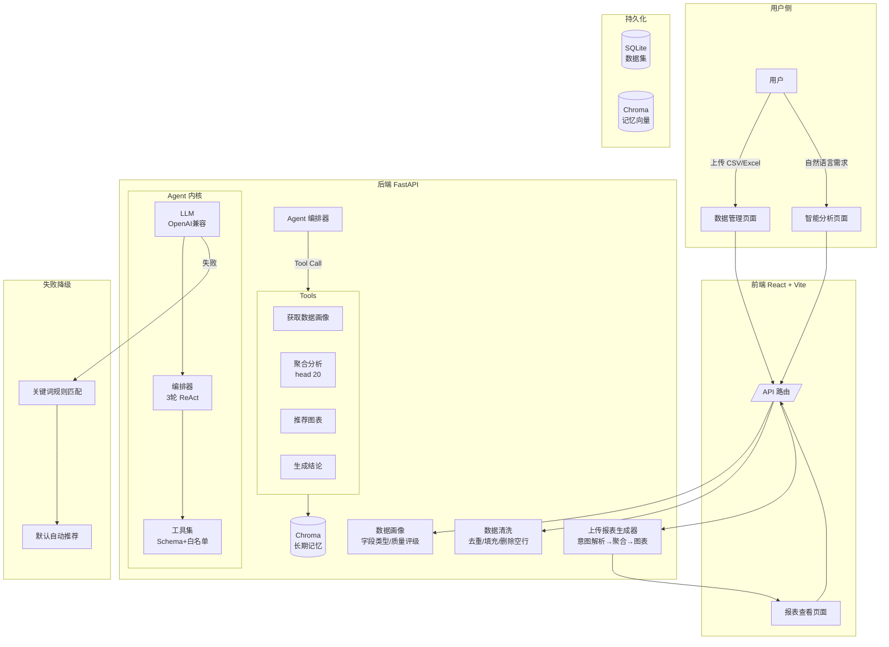

# 自助式数据分析 Agent 平台

> 上传 CSV / Excel → 自然语言描述分析目标 → 自动生成可视化报表
>
> 后端 FastAPI · 前端 React + Vite + Tailwind · Agent 内核用 OpenAI 兼容 LLM Function Calling

---

## 30 秒看懂

1. **是什么**：一个能用自然语言指挥生成报表的数据分析工具
2. **怎么跑**：`.\启动.ps1` 一键启动，浏览器自动打开 `http://127.0.0.1:5173`
3. **要不要 LLM key**：不配也能跑，自动降级到关键词匹配兜底；配了 DeepSeek/OpenAI key 用 LLM
4. **要不要 MySQL**：不要。SQLite 持久化，零外部服务，零网络依赖

---

## 架构概览



### 关键流程

```text
用户输入"按地区统计销售额占比"
  → Agent 第 1 轮：调「获取数据画像」感知数据特征
  → Agent 第 2 轮：调「聚合分析」按地区/销售额计算
  → Agent 第 3 轮：调「推荐图表」+「生成结论」
  → LLM 返回 JSON → 字段白名单校验 → pandas 执行 → ECharts 渲染
  → （失败时降级到关键词匹配，不阻挡用户使用）
```

---

## 快速开始

### 1. 装依赖

```powershell
pip install -r requirements.txt
```

### 2. 配 `.env`（可选但推荐）

```powershell
copy .env.example .env
```

打开 `.env` 把 `LLM_API_KEY=your_llm_api_key` 改成真实 DeepSeek / OpenAI key 即可。
不配也能跑，自然语言意图识别会自动降级到关键词匹配兜底。

### 3. 一键启动

```powershell
.\启动.ps1
```

会自动：

- 检查依赖
- 找空闲端口启动 FastAPI 后端（默认 8000）与 React 前端（默认 5173）
- 健康检查后端 `/health`
- 打开浏览器

**停止**：`.\启动.ps1 -Stop`
**只检查不启动**：`.\启动.ps1 -Check`

更多参数见 [`快速启动.md`](快速启动.md)。

---

## 项目结构

```text
自助式数据分析Agent平台/
├── 启动.ps1                  # 一键启动脚本（双击或 ./启动.ps1）
├── .env.example              # 环境变量模板（cp 成 .env 用）
├── requirements.txt          # Python 依赖清单
│
├── api/                      # FastAPI 路由层
│   ├── main.py
│   ├── contracts.py          # API 契约（Pydantic 模型）
│   ├── dependencies.py
│   └── routes/
│       ├── datasets.py       # POST /datasets/upload, GET /datasets/{id}
│       └── reports.py        # POST /reports/generate
│
├── 后端_核心/                  # 业务核心
│   ├── 文件数据服务.py         # CSV/Excel → DataFrame
│   ├── 数据画像.py           # DataFrame → 字段画像
│   ├── 上传报表生成器.py       # 主链路：df + 配置 → 报表 dict
│   ├── agent/                # ⭐ Agent 内核：LLM Function Calling + 字段白名单 + 兜底
│   │   ├── __init__.py
│   │   ├── llm客户端.py       # OpenAI 兼容 chat/completions 调用
│   │   ├── 工具集.py          # Tool schema + 字段白名单校验
│   │   └── 编排器.py          # 对外入口 解析自然语言需求
│   └── 存储/                  # ⭐ SQLite 持久化（阶段 2）
│       ├── __init__.py
│       └── sqlite_repo.py    # 仓储模式：参数化查询 + DataFrame JSON 序列化
│
├── frontend/                  # React + Vite + Tailwind 前端
│   └── src/
│       ├── App.jsx            # 路由 + 布局
│       ├── AppContext.jsx     # 跨页面状态共享
│       ├── api.js              # 7 个后端 API 调用封装
│       ├── components/
│       │   └── Sidebar.jsx    # 可折叠侧边栏导航
│       └── pages/
│           ├── DataManagement.jsx  # 上传/概览/字段列表/清洗
│           ├── Analysis.jsx        # NL 输入/图表选择/Agent 模式切换
│           └── Report.jsx          # 图表渲染/数据表/结论/Trace
├── tests/                    # 单元测试（不依赖网络与 LLM key）
│   ├── test_agent_意图.py     # 26 个：LLM 客户端/校验/编排器降级路径
│   └── test_sqlite_repo.py   # 11 个：仓储层 round-trip/重启/中文缺失值
│
├── data/
│   ├── daa.db                # SQLite 数据库（.gitignore 忽略）
│   └── uploads/             # 上传文件副本（.gitignore 忽略）
│
└── docs/
    ├── 项目开发日志.md           # 八阶段演进与设计决策
    ├── 项目开发日志_阶段1.md   # Agent 内核 + LLM Function Calling
    ├── 项目开发日志_阶段2.md   # 多轮 ReAct + Trace + LLM 结论润色
    ├── 项目开发日志_阶段3.md   # 前端重构 + 多智能体架构
    ├── 用户使用指南.md          # 完整使用说明
    └── LLM接入说明.md          # 配置 / 安全姿态 / 故障排除
```

---

## 核心接口

| 方法 | 路径 | 说明 |
|---|---|---|
| GET  | `/health` | 健康检查 |
| POST | `/datasets/upload` | 上传 CSV / Excel，返回数据集 ID + 字段画像 |
| GET  | `/datasets/{id}` | 凭 ID 取回数据集（预览前 20 行 + 画像） |
| POST | `/reports/generate` | 用自然语言 + 字段配置生成可视化报表 |
| GET  | `/datasets/` | 列出最近的数据集（阶段 2 新增） |

API 文档：启动后端后访问 `http://127.0.0.1:8000/docs`（FastAPI 自带 Swagger UI）。

---

## 测试

```powershell
python -m pytest tests/ -v
```

不依赖网络、不依赖真实 LLM key，37 个测试 1.5 秒跑完。

---

## Agent 内核设计要点（求职可讲点）

### 安全姿态

- **LLM 只输出结构化意图 JSON**，不生成可执行代码、不被 `exec` / `eval`
- 字段白名单：`X轴 / Y轴 / 分组字段` 必须在数据画像 `字段列表` 内，越界即视为失败
- LLM 凭据仅从 `EnvConfig.LLM_API_KEY` 读，源码中无 key
- 6 条失败路径全部静默回退到关键词匹配：未配 key / 网络异常 / HTTP 非 200 / 无 tool_call / tool 名错 / 字段越界

### 可观测性

- API 响应含 `意图来源` 字段，取值 `LLM / 规则 / 无`
- 前端用蓝色（LLM）/ 绿色（规则）/ 灰色（无）badge 展示
- 每条 LLM 失败路径 `logger.warning`，便于跑评测集合统计成功率

### 持久化

- SQLite 文件即数据库，零部署成本
- 仓储模式：未来切到 MySQL/Postgres 只换 `sqlite_repo.py`，路由层不动
- DataFrame → JSON 序列化进 TEXT 列（用 `StringIO` 防 pandas FutureWarning）

### 协议兼容

- OpenAI ↔ DeepSeek 同协议，切供应商只改 `.env` 三行，零代码改动

更多设计取舍见 [`docs/项目开发日志_阶段1.md`](docs/项目开发日志_阶段1.md) 与 [`docs/项目开发日志_阶段2.md`](docs/项目开发日志_阶段2.md)。

### 关键设计取舍（面试高频）

**为什么不用 LangChain？**

> 项目需求固定为 3 轮 Tool Calling，不需要 LangChain 的 Chain/Runnable/Memory 抽象层。自己处理 `chat/completion → JSON → executor` 的链路更透明，每步都在 Trace 中有对应记录。面试时说：**"简单场景 + 需要展示可控性 → 手写比框架更优。"**

**为什么不用 `exec(LLM 代码)`？**

> LLM Function Calling 将输出限制为结构化 JSON，经由字段白名单校验后才进入 pandas 执行器，全程无代码执行风险。面试时说：**"我不让 LLM 生成代码执行，而让它选择工具——参数越界即视为失败，回退到规则兜底。"**

**为什么需要规则兜底？**

> LLM 可能因网络、key 配置、输出格式异常等原因失败。三层降级（LLM → 关键词规则 → 默认自动推荐）确保**无 LLM key 也能完成完整的数据分析流程**。API 响应中的 `意图来源` 字段标明本请求是 LLM 还是规则在决策。

**上下文过长怎么处理？**

> 项目通过三层隔离控制上下文：LLM 只看数据画像（行数/列数/字段列表），不是完整 DataFrame；工具执行结果只返回前 20 行摘要；Trace 有记录数上限和截断。选字段和图表类型由 LLM 决策，数据计算由后端工具执行——LLM 只接触 schema 和摘要，不接触原始数据。

### 评测结果（Golden Set，36 条）

> 评测脚本 `scripts/eval_agent.py` 覆盖柱状图/折线图/饼图/散点图/热力图/堆积柱状图/面积图/雷达图等 10 种图表类型，四维指标分别统计。

**当前结果为"规则兜底模式"基线评测，未开启真实 LLM 推理。** 这组数据的作用是建立起点——接 LLM 后对比观察完全匹配率、字段命中率和规则兜底率的变化。

| 指标 | 规则兜底（Baseline） | LLM 路径（待测） |
|------|---------------------|-------------------|
| 完全匹配率 | 22%（8/36） | — |
| 图表类型准确率 | 69%（25/36） | — |
| X 轴命中率 | 61%（22/36） | — |
| Y 轴命中率 | 50%（18/36） | — |
| 聚合方式命中率 | 81%（29/36） | — |

### 下一步优化目标

- 完全匹配率：22% → 50%+
- 图表类型准确率：69% → 85%+
- X/Y 字段命中率：50~61% → 75%+
- 增加 LLM 模式与规则模式对比评测
- 增加失败样例分析，用于改进 prompt 与规则兜底

> 配好 LLM key 后跑 `python scripts/eval_agent.py --verbose` 即可更新 LLM 路径分数，验证提升效果。

### 界面预览

> 启动后打开 `http://127.0.0.1:5173` 即可查看以下页面（截图待补）：

| 页面 | 功能 |
|------|------|
| 📁 数据管理 | 上传 CSV/Excel → 字段画像 → A/B/C 质量评级 → 一键清洗 |
| 🧠 智能分析 | 自然语言输入 → 图表类型选择 → 单Agent/多智能体切换 → 模型选择 |
| 📊 报表查看 | ECharts 图表渲染 → 数据表 → 分析结论 → Agent Trace → HTML/JSON 导出 |

---

## 技术栈

| 层 | 技术 |
|---|---|
| 后端 | Python 3.11 · FastAPI · uvicorn · pandas · openpyxl |
| Agent | OpenAI 兼容 chat/completions · Function Calling · DeepSeek / OpenAI |
| 持久化 | SQLite（Python 标准库 `sqlite3`，零依赖） |
| 前端 | React 19 · Vite · Tailwind CSS v4 · 手写图表渲染 |
| 测试 | pytest |

---

## 故障排除

| 问题 | 解决 |
|---|---|
| PowerShell 不让跑脚本 | `Set-ExecutionPolicy -Scope Process Bypass` |
| 8000 端口被占 | `.\启动.ps1 -BackendPort 8001` |
| 8501 端口被占 | `.\启动.ps1 -FrontendPort 8502` |
| `意图来源` 一直是 `规则` | `.env` 里 `LLM_API_KEY` 还是占位，改成真实 DeepSeek key |
| 重启后数据丢了 | 检查 `data/daa.db` 是否被手动删除或被 git 处理 |
| 停不掉进程 | 任务管理器搜 `python.exe` 手动结束，或删 `.reasonix/run/daa_pids.json` |
